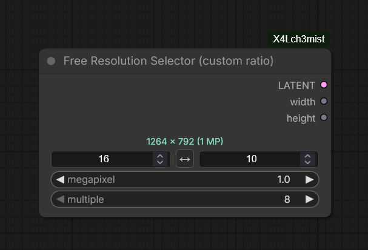
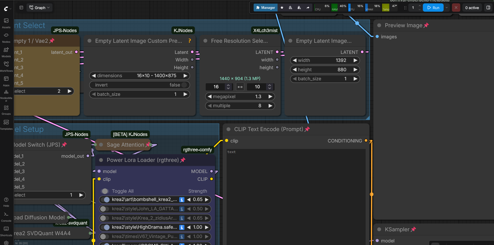
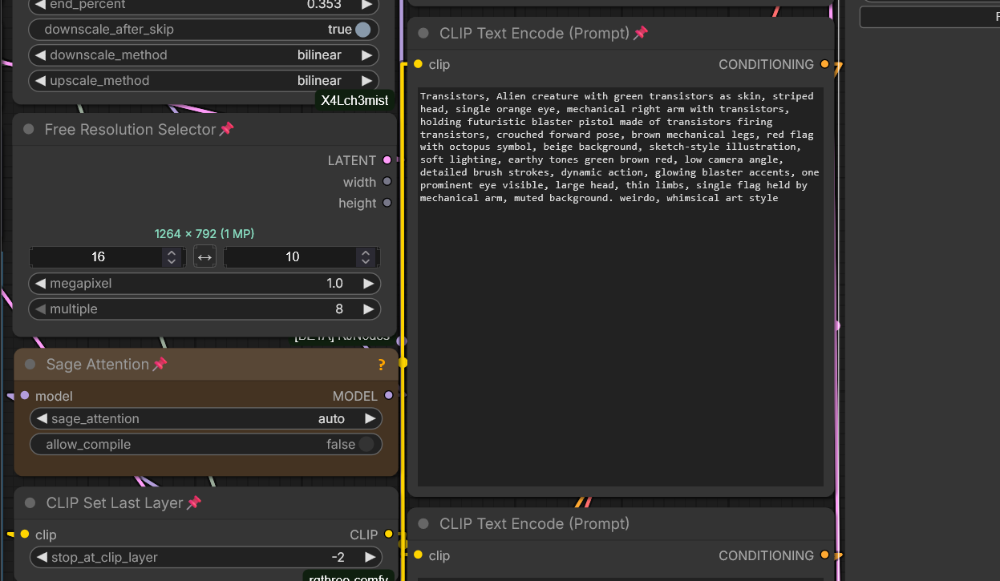

# Free Resolution Selector (custom ratio)

Like the built-in ResolutionSelector, but with a freely configurable aspect ratio instead of a fixed dropdown.

- Any aspect ratio via two numeric fields (e.g. 16:10, 21:9, 7:5)
- Target size in megapixels
- Rounding to a multiple of your choice (8–128)
- Live preview of the resulting resolution and actual megapixels
- Swap button to flip between landscape and portrait
- Width and height as separate INT outputs, usable with any empty latent node

Outputs an empty latent (16 channels, 8x downscale). Tested with Anima, Flux 2, Krea 2 and SDXL.

Category: `X4Lch3mist/latent`

Samples: 

